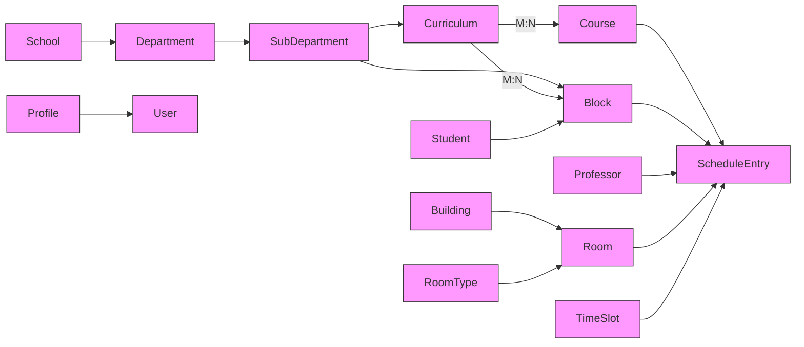

# AIMI — Academic Timetabling

Lightweight Django backend and React frontend for managing academic data and generating schedules.

Quick start

Backend
- Create and activate a Python virtual environment (Python 3.11+ recommended).
- Install dependencies: `pip install -r requirements.txt`.
- Apply migrations: `python manage.py migrate`.
- (Optional) Create a superuser: `python manage.py createsuperuser`.
- Run dev server: `python manage.py runserver`.

Frontend
- Install dependencies: `cd frontend && npm install`.
- Run dev server: `npm start`.
- Build production assets: `npm run build` (outputs to `frontend/build`).

Site flow (pages)
- Admin Dashboard — entry for administrators.
  - Academic Resources: manage `Courses`, `Curricula` (links courses to blocks), `Buildings`, `Rooms`, `Professors`, `Blocks`.
  - Schedule Generator: run the scheduler to produce timetable entries.
  - Schedule Viewer: inspect generated timetables and export.
- Professor Dashboard — view assignments relevant to a professor.
- Student Dashboard — view schedule for a student/block.
- Authentication: signup, login, and profile endpoints.

API notes
- Use `curricula` to associate `course`s with `block`s (replaces the legacy `course-offerings` endpoint).
- Trigger schedule generation: `POST /api/schedule-entries/generate/`.
- Common endpoints: `/api/courses/`, `/api/curricula/`, `/api/blocks/`, `/api/rooms/`, `/api/professors/`, `/api/schedule-entries/`.

Testing & maintenance
- Run backend tests: `python manage.py test`.
- After model changes: `python manage.py makemigrations` and `python manage.py migrate`.

If you want, I can add a migration to convert legacy `CourseOffering` rows into `Curriculum` links or remove other deprecated UI elements.

Data Model

| Model | Key fields | Relations |
|---|---|---|
| School | `name` | has many `Department` |
| Department | `name` | FK -> `School`; has many `SubDepartment` |
| SubDepartment | `name`, `number` | FK -> `Department`; has many `Block`, `Curriculum` |
| Block | `code`, `year` | FK -> `SubDepartment`; referenced by `Curriculum` (M2M) and `ScheduleEntry` |
| Curriculum | `name` | FK -> `SubDepartment`; M2M -> `Course`; M2M -> `Block` (used to assign courses to blocks)
| Course | `name`, `code`, `duration_minutes`, `frequency_per_week`, `units` | M2M -> `Curriculum` (a course can appear in multiple curricula)
| Professor | `name`, `user` (opt), `email`, `department`, `sub_department`, `max_units` | FK -> `Department` / `SubDepartment`; referenced by `ScheduleEntry` |
| Student | `user`, `department`, `sub_department`, `year`, `block` | FK -> `Block`; used for student views |
| Building | `name` | has many `Room` |
| RoomType | `name` | referenced by `Room` |
| Room | `building`, `number`, `floor`, `room_type`, `capacity` | FK -> `Building`, `RoomType`; used by `ScheduleEntry` |
| TimeSlot | `day`, `start_time`, `end_time` | used by `ScheduleEntry` to represent a scheduled slot |
| ScheduleEntry | (generated) `course`, `block`, `professor`, `room`, `time_slot` | Represents one scheduled class session (result of scheduler)
| Profile | `user`, `role`, `department`, `sub_department`, `year`, `block` | One-to-one with auth `User`; stores authoritative role info

Notes
- The legacy `CourseOffering` model and `/api/course-offerings/` endpoint have been removed; use `Curriculum` to link `Course` <-> `Block`.
- The `YearLevel` model was removed — curricula and blocks cover course grouping by year.
- `ScheduleEntry` rows are created by the scheduler and represent assigned sessions (no separate `CourseOffering` is required).

Data Model Diagram

EXPECTED SITE FLOW

User opens system

User completes payment

User uploads / inputs scheduling data

System validates data

System generates initial schedule

System resolves conflicts

AI analyzes the schedule

User reviews, accepts, or regenerates

User exports final schedule

---

SCREEN-BY-SCREEN STORYBOARD

Screen 1: Landing Page

User sees:

Project title (AIMI Smart Schedule Optimizer)

Short description

"Start Scheduling" button

User action: Clicks Start Scheduling

## System action: Redirects to Login Screen (if not already Logged in)

Screen 2: Login

Username/Email

Password

System actions:
Verify Login

## Redirect to Data Input Dashboard

Screen 3: Data Input Dashboard

User sees tabs or sections for:

Subjects

Professors

Rooms

Class Code

Block

User actions:

Fill up forms OR upload CSV files

Click "Validate Data"

System actions:

Checks missing fields

Checks invalid time ranges

## Stores validated data in database

Screen 4: Schedule Generation

User sees:

"Generate Schedule" button

## System action: Redirects to payment screen

Screen 5: Payment Gate (PayPal)

User sees:

Explanation of why payment is required

PayPal checkout button

User action: Completes payment

System action:

Verifies payment via PayPal API

Grants access token / session

No payment = no schedule generation

Loading indicator

Backend process:

Sort subjects by priority

Apply greedy algorithm

Assign time, room, professor

Data Structures involved:

Priority Queue (subject priority)

## Hash Maps (availability lookup)

Screen 6: Conflict Detection & Resolution

System (not user-facing):

Detects conflicts using graphs

Applies backtracking when constraints fail

Enforces 12-hour max campus stay

Output:

## Feasible schedule OR regeneration attempt

Screen 7: Schedule Preview

User sees:

Timetable view (per section / professor)

Highlighted inefficiencies (optional)

User actions:

Accept schedule

Regenerate

## Request AI analysis

Screen 8: AI-Assisted Analysis

System action:

Sends schedule summary to LLM

Receives insights such as:

Long gaps

Uneven workload

Room underutilization

User sees:

Human-readable suggestions

## "Apply suggestions" (optional / advisory)

Screen 9: Finalization & Export

User actions:

Confirm final schedule

Export as PDF / CSV

System actions:

Locks schedule

Generates downloadable file

---

SYSTEM SCOPE

Primary User: Faculty staff / Department coordinator
Goal: Generate an optimized, conflict-free academic schedule

System Modules:

Frontend (React)

Backend (Django REST)

Scheduling Engine (Algorithms)

AI Analysis Layer

Payment (PayPal)

Database (PostgreSQL)
